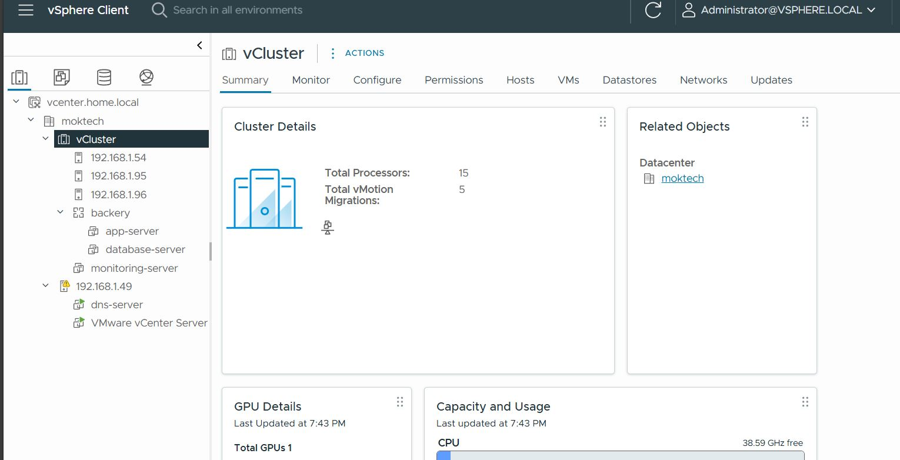
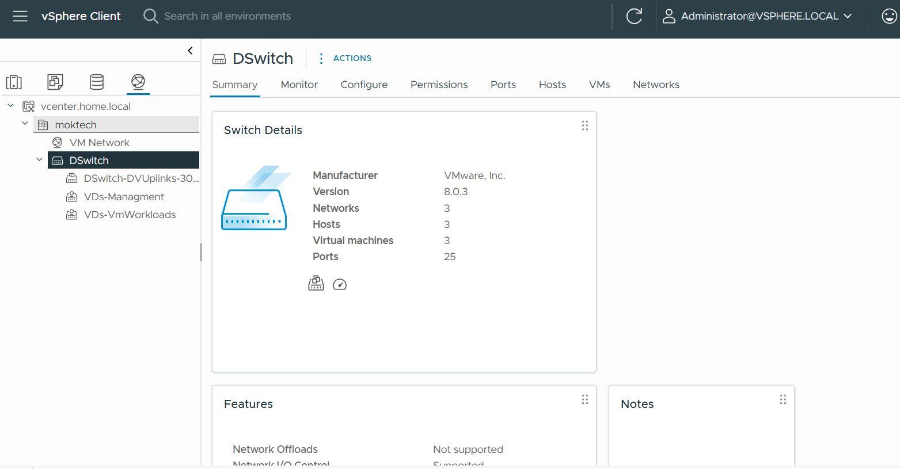
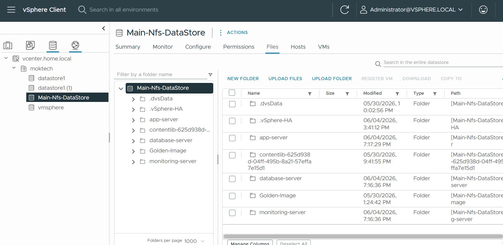
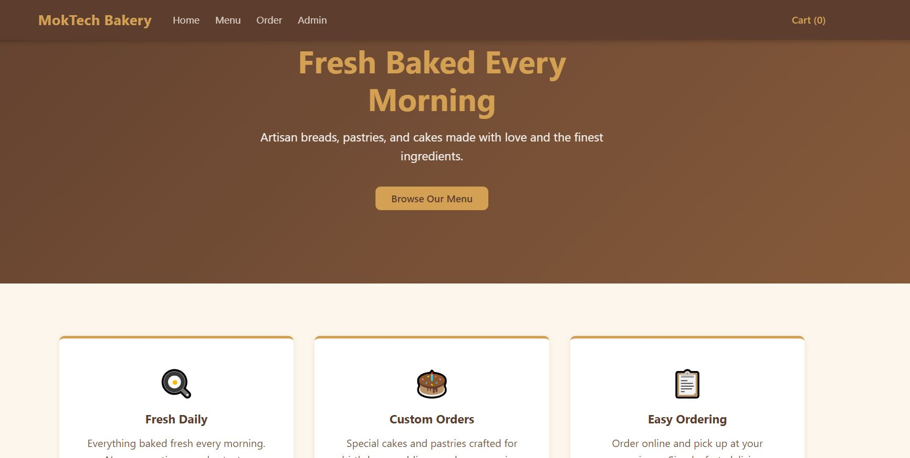
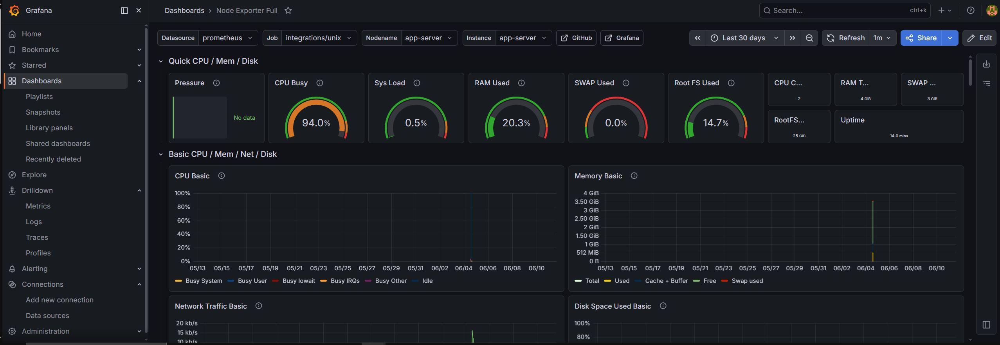
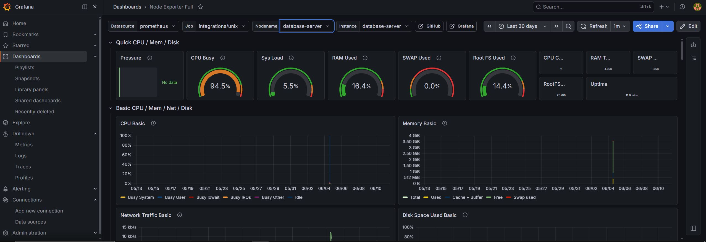
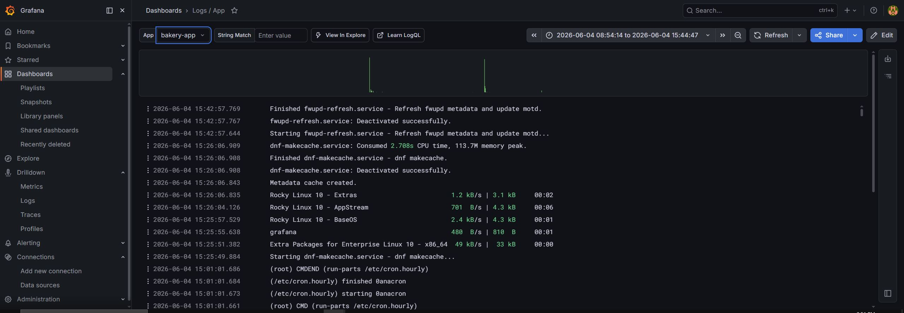
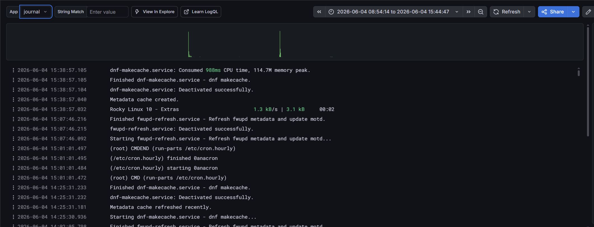
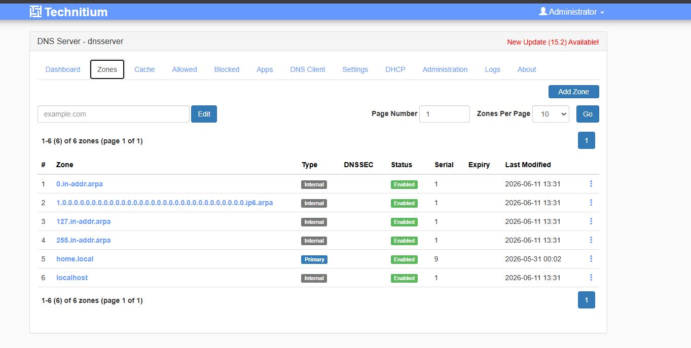
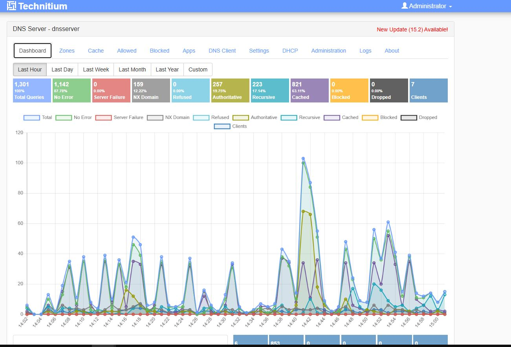

# MokTech Lab — Small Bakery

A home lab VMware vSphere environment built to host a small bakery web application.

---

## Infrastructure

- 4 ESXi hosts connected through a router
- Host 1 runs vCenter and DNS — kept off the cluster to preserve resources
- Hosts 2, 3, and 4 form a 3-node workload cluster with HA and DRS (automatic mode)
- A physical NAS server provides shared NFS storage for VM datastore and content library
- Host 1 uses a Standard Switch (VSS), Hosts 2-4 use a Distributed Switch (VDS)

## Application

A FastAPI + PostgreSQL bakery website with an online ordering system, deployed across two VMs:

- **App VM** — FastAPI backend, Nginx reverse proxy, served at `bakery-app.home.local`
- **Database VM** — PostgreSQL, accessible only from the app VM

Both VMs are grouped under a vApp with the database starting before the app.

## Observability

- Grafana Alloy runs on each VM, shipping metrics and logs to the monitoring VM
- Prometheus stores metrics, Loki stores logs, Grafana provides dashboards
- Two dashboards: Node Exporter Full (system metrics) and Logs/App (nginx, app, journal logs)

## Supporting Services

- **DNS** — Technitium DNS server managing the `home.local` zone
- **Golden Image** — Rocky Linux 10 template stored in the content library, used as the base for all VMs
- **Patching** — automatic security updates via `dnf-automatic` every weekend at 12:00

---

## Screenshots

---

## Docs

All documentation is under `DOCS/` and SOPs are under `SOPs/`.
